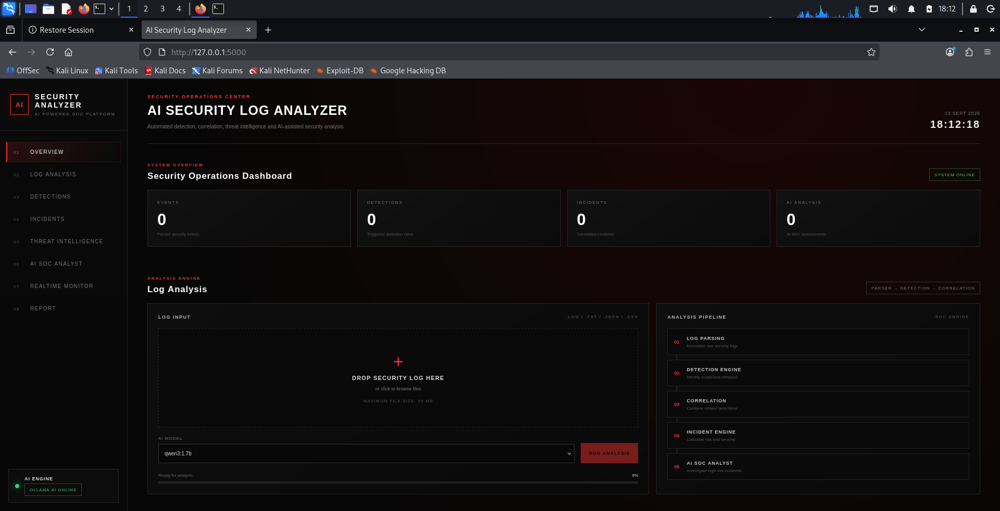
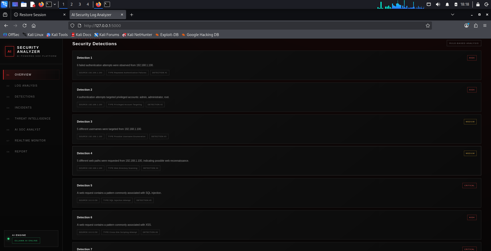
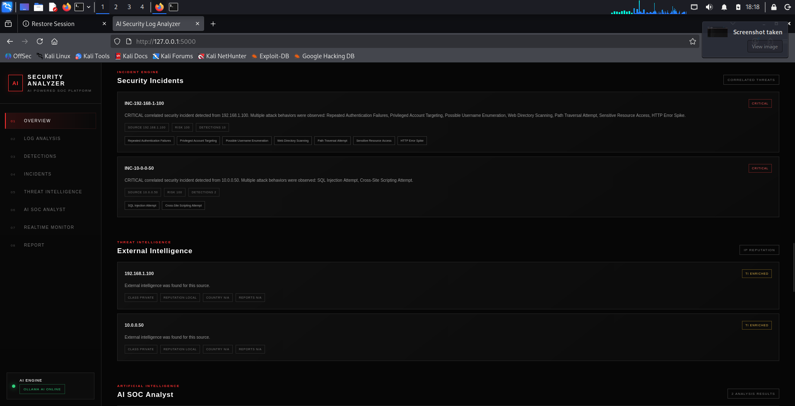

# AI Security Log Analyzer

## AI-Powered Security Monitoring, Detection & Incident Analysis Platform

AI Security Log Analyzer is a lightweight SOC/SIEM-style cybersecurity platform that analyzes security logs, detects suspicious activity, correlates security events into incidents, enriches IP addresses with threat intelligence, and uses a locally hosted Large Language Model (LLM) to assist with security analysis.

---

## Overview

AI Security Log Analyzer is designed to demonstrate practical cybersecurity skills across Security Operations Center (SOC) monitoring, detection engineering, incident analysis, threat intelligence, AI-assisted security analysis, Python development, Flask development, and Linux security.

The platform processes security logs through a modular security-analysis pipeline:

    Log File
        |
        v
    Parser Manager
        |
        v
    Security Event Normalization
        |
        v
    Detection Engine
        |
        v
    Detection Correlation
        |
        v
    Incident Engine
        |
        +----------------------+
        |                      |
        v                      v
    Threat Intelligence    AI SOC Analyst
        |                      |
        +----------+-----------+
                   |
                   v
            SOC Dashboard

The goal is to combine deterministic security detections with threat intelligence and local AI-assisted analysis.

---

# Key Features

- Security log analysis
- AI-assisted threat analysis
- Suspicious activity detection
- Security-focused dashboard

## Multi-Source Log Analysis

The platform currently supports:

- SSH authentication logs
- Apache web server logs
- Nginx web server logs
- Firewall logs

A centralized Parser Manager identifies supported log formats and converts recognized entries into normalized SecurityEvent objects.

---

## Security Event Normalization

Different log formats are converted into a common security event structure.

Security events can contain:

- Timestamp
- Source
- Event type
- Severity
- Source IP
- Destination IP
- Source port
- Destination port
- Username
- Hostname
- Message
- Raw log
- Metadata

This allows detection logic to operate consistently across multiple log sources.

---

# Detection Engine

The detection engine uses rule-based security analytics to identify suspicious behavior.

Current detections include:

### Authentication

- Repeated authentication failures
- Privileged account targeting
- Username enumeration

### Network

- Port scanning
- Firewall block spikes

### Web Security

- Web directory scanning
- SQL injection attempts
- Cross-site scripting (XSS)
- Path traversal attempts
- Command injection
- Sensitive resource access
- Suspicious user agents
- HTTP error spikes

The detection engine generates structured security detections that can contain:

- Detection type
- Severity
- Source IP
- Description
- Count
- Username
- Evidence

---

# Detection Correlation

The platform correlates multiple detections associated with the same source IP.

For example:

    Repeated Authentication Failures
                    +
    Privileged Account Targeting
                    +
    Username Enumeration
                    +
    Web Directory Scanning
                    +
    Path Traversal
                    |
                    v
            Correlated Activity
                    |
                    v
              Security Incident

This helps identify broader attack behavior rather than treating every detection as an isolated alert.

---

# Incident Engine

The Incident Engine converts security detections into structured security incidents.

Each incident can contain:

- Incident ID
- Source IP
- Severity
- Risk score
- Detection count
- Attack types
- Detection evidence
- Incident status
- Incident summary

Example:

    Incident ID: INC-192-168-1-100
    Source IP: 192.168.1.100
    Severity: CRITICAL
    Risk Score: 100/100
    Status: OPEN

---

# Risk Scoring

The Incident Engine uses severity-based scoring.

Current base scores:

    INFO       = 5
    LOW        = 15
    MEDIUM     = 35
    HIGH       = 60
    CRITICAL   = 90

Multiple attack behaviors can increase the incident score.

The final risk score is capped at:

    100 / 100

Incident severity is derived from the resulting risk score.

---

# Threat Intelligence

The platform integrates external threat intelligence for public IP addresses.

Current provider:

    AbuseIPDB

The AbuseIPDB integration can provide:

- IP address
- Reputation
- Malicious status
- Confidence
- Abuse confidence score
- Total reports
- Country
- ISP
- Domain
- Usage type
- Whitelist status
- Provider information

The system classifies IP addresses before performing external intelligence lookups.

Private, loopback, reserved, multicast, link-local, and other non-public addresses are handled locally.

Threat intelligence is treated as supporting evidence rather than absolute proof of malicious activity.

---

# AI SOC Analyst

The project integrates a locally hosted Large Language Model through Ollama.

The AI SOC Analyst receives structured security evidence generated by the detection and incident pipeline.

The AI can provide:

- Security verdict
- Attack analysis
- MITRE ATT&CK mapping
- Key evidence
- Recommended response
- Confidence assessment
- Analysis limitations

The AI is intended to assist a SOC analyst with investigation and prioritization.

---

# Evidence-Driven AI

The AI analysis is designed around an evidence-first approach.

The AI is instructed to:

- Use only the provided security evidence
- Avoid inventing events
- Avoid inventing IP addresses
- Avoid inventing usernames
- Avoid inventing commands
- Avoid inventing threat intelligence
- Separate observed behavior from inference
- Avoid claiming successful compromise without evidence

Suspicious activity does not automatically mean that a system has been compromised.

---

# Local AI Architecture

The AI layer is modular and uses an LLM provider abstraction.

    Security Incident
            |
            v
    Security Context Builder
            |
            v
        AI Prompt
            |
            v
      Ollama Provider
            |
            v
       Local LLM
            |
            v
    AI SOC Assessment

The current architecture allows Ollama-compatible models to be selected through the dashboard.

---

# Supported AI Models

The current environment includes Ollama-based models such as:

- qwen3:1.7b
- llama3.2:latest

Additional Ollama-compatible models can be used if installed locally.

The dashboard includes an AI model selector.

---

# Web Dashboard

The project includes a Flask-based red-and-black cybersecurity dashboard.

The dashboard provides:

- Security log upload
- Drag-and-drop upload
- File validation
- AI model selection
- Analysis progress
- Event statistics
- Detection statistics
- Incident statistics
- AI analysis statistics
- Security incidents
- Detection results
- Threat intelligence
- AI SOC Analyst results

The completed analysis remains displayed in the dashboard instead of redirecting the user away from the results.

---

# Dashboard Workflow

    Upload Log
        |
        v
    Select AI Model
        |
        v
    Start Analysis
        |
        v
    Parse Log
        |
        v
    Detect Suspicious Activity
        |
        v
    Correlate Detections
        |
        v
    Create Incidents
        |
        v
    Enrich Public IPs
        |
        v
    AI SOC Analysis
        |
        v
    Display Results

---

# Architecture

    +----------------------+
    |     Security Logs    |
    +----------+-----------+
               |
               v
    +----------------------+
    |    Parser Manager    |
    +----------+-----------+
               |
               v
    +----------------------+
    | SecurityEvent Model  |
    +----------+-----------+
               |
               v
    +----------------------+
    |   Detection Engine   |
    +----------+-----------+
               |
               v
    +----------------------+
    | Correlation / Rules  |
    +----------+-----------+
               |
               v
    +----------------------+
    |   Incident Engine    |
    +-----+-----------+----+
          |           |
          v           v
    +-----------+ +-----------+
    | Threat    | | AI SOC    |
    | Intel     | | Analyst   |
    +-----------+ +-----------+
          |           |
          +-----+-----+
                |
                v
    +----------------------+
    |    SOC Dashboard     |
    +----------------------+

---

# Technology Stack

| Category | Technology |
|---|---|
| Programming Language | Python 3 |
| Web Framework | Flask |
| Frontend | HTML5, CSS3, JavaScript |
| HTTP Client | Requests |
| Local AI Runtime | Ollama |
| AI Models | Qwen, Llama, Ollama-compatible models |
| Threat Intelligence | AbuseIPDB |
| Operating System | Kali Linux |
| Environment | Python Virtual Environment |
| Architecture | Modular Python |

---

# Project Structure

    ai-security-log-analyzer/
    |
    +-- analyzer.py
    +-- analyzer_backup.py
    +-- detection_engine.py
    +-- event_schema.py
    +-- log_detector.py
    |
    +-- parsers/
    |   +-- __init__.py
    |   +-- ssh.py
    |   +-- apache.py
    |   +-- nginx.py
    |   +-- firewall.py
    |   +-- manager.py
    |
    +-- detection/
    |   +-- __init__.py
    |
    +-- correlation/
    |   +-- __init__.py
    |
    +-- incident/
    |   +-- __init__.py
    |   +-- engine.py
    |
    +-- threat_intelligence/
    |   +-- __init__.py
    |   +-- enricher.py
    |   +-- providers/
    |       +-- __init__.py
    |       +-- base.py
    |       +-- abuseipdb.py
    |
    +-- ai/
    |   +-- __init__.py
    |   +-- soc_agent.py
    |   +-- context_builder.py
    |   +-- prompts.py
    |   +-- model_manager.py
    |   +-- providers/
    |       +-- __init__.py
    |       +-- base.py
    |       +-- local.py
    |
    +-- gui/
    |   +-- __init__.py
    |   +-- app.py
    |   +-- templates/
    |   |   +-- index.html
    |   +-- static/
    |       +-- css/
    |       |   +-- style.css
    |       +-- js/
    |           +-- app.js
    |
    +-- tests/
    |
    +-- sample_logs/
    |   +-- auth.log
    |   +-- firewall.log
    |   +-- apache.log
    |   +-- nginx.log
    |   +-- access.log
    |   +-- nginx_access.log
    |   +-- suspicious.log
    |   +-- quick_test.log
    |
    +-- reports/
    |
    +-- .env.example
    +-- .gitignore
    +-- requirements.txt
    +-- README.md

---

# Installation

## Requirements

- Python 3
- Python virtual environment support
- Flask
- Requests
- Ollama
- At least one compatible Ollama model
- Optional AbuseIPDB API key

---

## Clone the Repository

    git clone https://github.com/akhilssethhck/ai-security-log-analyzer.git
    cd ai-security-log-analyzer

---

## Create a Virtual Environment

    python3 -m venv .venv

---

## Activate the Environment

    source .venv/bin/activate

---

## Install Dependencies

    pip install -r requirements.txt

---

## Verify Ollama

    ollama list

---

## Install an AI Model

Example:

    ollama pull qwen3:1.7b

---

## Configure Environment Variables

    cp .env.example .env

Add the required AbuseIPDB API key if external threat intelligence enrichment is enabled.

---

# Running the Application

Activate the virtual environment:

    source .venv/bin/activate

Start the application:

    python -m gui.app

Open the dashboard:

    http://127.0.0.1:5000

---

# Example Security Scenario

A log containing repeated failed SSH authentication attempts can trigger:

    Repeated Authentication Failures

Additional activity from the same source can produce:

    Privileged Account Targeting
    Username Enumeration
    Web Directory Scanning
    Path Traversal
    Sensitive Resource Access
    HTTP Error Spike

These detections can then be correlated into a single security incident.

The incident can be enriched with threat intelligence and passed to the local AI SOC Analyst for evidence-based analysis.

---

# Example Incident

    Incident ID:
    INC-192-168-1-100

    Source IP:
    192.168.1.100

    Severity:
    CRITICAL

    Risk Score:
    100/100

    Status:
    OPEN

Possible attack behaviors:

    - Repeated Authentication Failures
    - Privileged Account Targeting
    - Username Enumeration
    - Web Directory Scanning
    - Path Traversal
    - Sensitive Resource Access
    - HTTP Error Spike

---

# Security Design Principles

## Evidence First

Security conclusions should be based on available telemetry and detection evidence.

## Defense in Depth

The project uses multiple analysis layers:

    Parsing
       |
    Detection
       |
    Correlation
       |
    Incident Analysis
       |
    Threat Intelligence
       |
    AI Analysis

## Human Analyst Support

The AI SOC Analyst is designed to support human investigation rather than replace security analysts.

## No Unsupported Compromise Claims

Suspicious behavior alone does not prove successful compromise.

## Threat Intelligence as Supporting Evidence

External reputation information should be combined with local security telemetry and analyst judgment.

## Local AI Processing

The primary LLM analysis runs locally through Ollama.

---

# Security Considerations

The application is intended for authorized defensive security analysis.

Important considerations:

- Only analyze logs you are authorized to access.
- Never commit API keys.
- Never commit passwords or credentials.
- Never commit private production logs.
- Keep `.env` out of version control.
- Review external threat intelligence usage before production deployment.
- Treat AI recommendations as analyst assistance.
- Validate security decisions using the original evidence.

---

# Current Limitations

The current version is a lightweight SOC/SIEM-style security analysis platform.

It is not intended to replace a full enterprise SIEM.

Current limitations include:

- Primarily file-based log analysis
- No persistent database-backed incident storage
- No enterprise-scale event ingestion
- Limited log-source coverage
- Limited automated response functionality
- No complete dedicated MITRE ATT&CK knowledge base
- No production-grade distributed architecture
- No full user authentication and authorization system

---

# Roadmap

## Completed

- [x] Modular parser architecture
- [x] SSH log parser
- [x] Apache log parser
- [x] Nginx log parser
- [x] Firewall log parser
- [x] Normalized SecurityEvent model
- [x] Rule-based detection engine
- [x] Detection correlation
- [x] Incident engine
- [x] Risk scoring
- [x] Threat intelligence integration
- [x] AbuseIPDB integration
- [x] Ollama integration
- [x] Local AI SOC Analyst
- [x] AI model selection
- [x] Flask dashboard
- [x] Red-and-black SOC interface
- [x] Log upload
- [x] Analysis progress
- [x] Security metrics
- [x] Incident results
- [x] Detection results
- [x] Threat intelligence results
- [x] AI analysis results

## Planned

- [ ] Real-time Linux log monitoring
- [ ] Continuous event ingestion
- [ ] Advanced dashboard charts
- [ ] Event search
- [ ] Event filtering
- [ ] Advanced incident filtering
- [ ] Persistent incident database
- [ ] Dedicated MITRE ATT&CK mapping engine
- [ ] ATT&CK technique visualization
- [ ] Windows Event Log support
- [ ] Network telemetry
- [ ] Endpoint telemetry
- [ ] Alert notifications
- [ ] JSON report export
- [ ] CSV report export
- [ ] PDF incident reports
- [ ] User authentication
- [ ] Role-based access control
- [ ] Automated response workflows
- [ ] Containerized deployment

---

# Why This Project?

Security operations teams process large amounts of telemetry every day.

Traditional rule-based detection is effective at identifying known patterns, but analysts still need to investigate, correlate, prioritize, and interpret security evidence.

This project explores an architecture that combines:

    Rule-Based Detection
             +
    Event Correlation
             +
    Incident Management
             +
    Threat Intelligence
             +
    Local AI
             |
             v
    AI-Assisted Security Analysis

The purpose is not to replace deterministic security controls with AI.

Instead, AI is used as an additional analysis layer that helps summarize evidence and support analyst decision-making.

---

# Screenshots

## Web Interface

## Security Analysis

## AI SOC Analysis

# Skills Demonstrated

## Cybersecurity

- Security monitoring
- Log analysis
- Detection engineering
- Incident analysis
- Threat intelligence
- Security event normalization
- Attack behavior detection
- Risk prioritization

## SOC Operations

- Alert analysis
- Incident correlation
- Security triage
- Evidence-based investigation
- Threat intelligence enrichment
- AI-assisted analysis

## Programming

- Python
- Flask
- JavaScript
- HTML
- CSS
- REST-style endpoints
- Modular application architecture
- API integration
- Exception handling
- Virtual environments

## Artificial Intelligence

- Local LLM deployment
- Ollama
- Prompt engineering
- Structured security context
- AI-assisted incident analysis
- Evidence-constrained AI responses

## Linux

- Kali Linux
- Linux security logs
- Python environments
- Local services
- Command-line development

---

# Portfolio Demonstration

A typical demonstration:

    1. Start Ollama
    2. Start the Flask dashboard
    3. Open the dashboard
    4. Select a sample security log
    5. Select an AI model
    6. Start analysis
    7. Review parsed events
    8. Review security detections
    9. Review correlated incidents
    10. Review threat intelligence
    11. Review AI SOC assessment

---

# Repository Security

Before pushing the project to GitHub, verify that sensitive files are not staged.

Run:

    git status

The repository should not contain:

    .env
    API keys
    passwords
    private credentials
    private production logs
    sensitive personal information

The project includes `.gitignore` rules for common sensitive and temporary files.

---

# License

This project is intended for educational, defensive security research, authorized security testing, and cybersecurity development.

A suitable open-source license can be added before public release.

---

# Disclaimer

This project is intended for:

- Cybersecurity education
- Defensive security research
- SOC development
- Security monitoring
- Authorized security testing
- Log analysis research

Only analyze systems, networks, and logs that you own or have explicit permission to monitor.

The project does not guarantee complete detection or prevention of security incidents.

AI-generated security assessments should be reviewed by a qualified human analyst before consequential actions are taken.

---

# Author

## Akhil S S

Cybersecurity Student

Areas of Focus:

- Cybersecurity
- SOC Operations
- Ethical Hacking
- Detection Engineering
- Security Monitoring
- Threat Intelligence
- AI Security
- Linux Security
- Python

GitHub:

https://github.com/akhilssethhck

---

# Project Status

**Active Development**

The core log analysis, detection, correlation, incident management, threat intelligence, local AI, and dashboard components are implemented.

The project is continuing toward a lightweight AI-assisted SOC platform with real-time monitoring, expanded telemetry, advanced analytics, MITRE ATT&CK integration, and professional incident reporting.

---

## Star the Repository

If you find this project useful for learning about cybersecurity, SOC operations, detection engineering, or AI-assisted security analysis, consider starring the repository and following its development.

